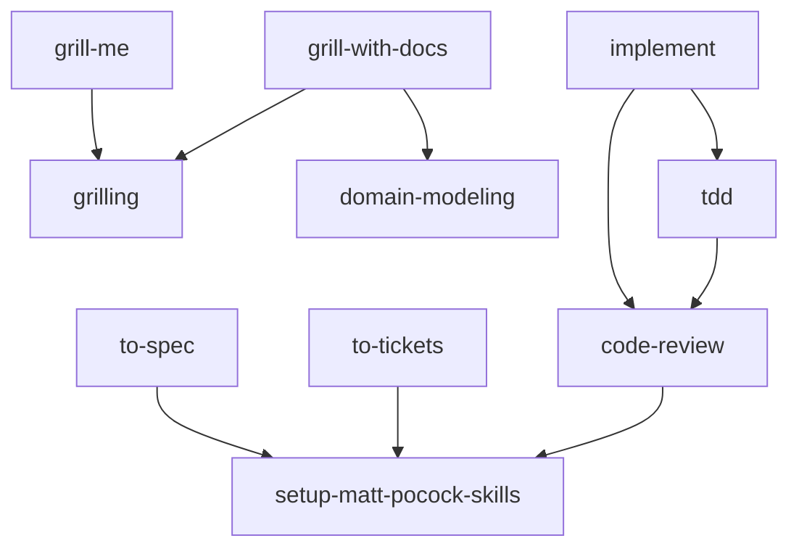

# mattpocock 技能家族

来自 [mattpocock/skills](https://github.com/mattpocock/skills)，这套技能**相互依赖**，需要整组安装使用，不能单独拆开。

## 依赖关系

## 使用流程

1. 首次在新仓库使用时，先运行 `setup-matt-pocock-skills`，配置 issue tracker、标签词汇和领域文档布局（生成 `docs/agents/*.md`）。
2. 澄清需求：`grill-me` / `grill-with-docs`（后者会同时产出 ADR 与术语表）。
3. 规划：`domain-modeling` 维护 `CONTEXT.md` 领域词汇；`to-spec` 产出 spec；`to-tickets` 拆票。
4. 实施：`implement` 按 spec/tickets 开工，内部调用 `tdd` 与 `code-review`。
5. 文档：`writing-for-agents` 用于编写 agent 消费的文档（AGENTS.md / CLAUDE.md / skill）。
6. 教学：`teach` 在项目内交互式教学。

## 未收录的关联技能

以下技能与这套家族相关但未收录，按需可补充：

- `codebase-design`（tdd 在接口形态不明时软依赖）
- `triage`（setup 检测到已安装时才会配置 triage 标签）
- `research`、`wayfinder`、`wizard`、`prototype`、`diagnosing-bugs`、`resolving-merge-conflicts`（完整工程工作流中的其他环节）
- `productivity/` 下的 `handoff`、`wait-what`、`to-questionnaire`、`grilling`（已收录）等
